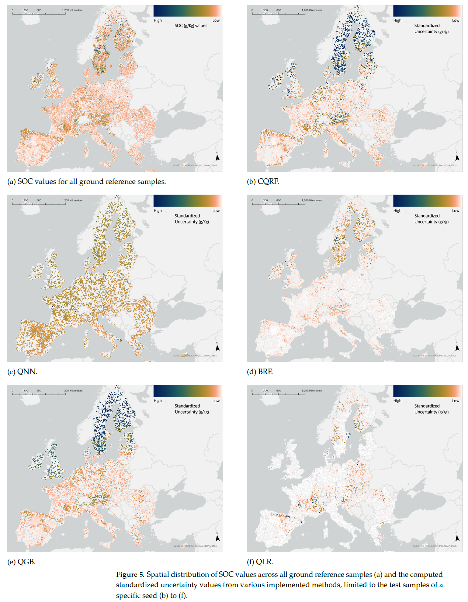

# Conformal_Prediction_DSM

Implementation of conformal prediction as an uncertainty quantification method for soil organic carbon estimation. 



Please site: 

<pre>
```bib
@Article{rs16030438,
AUTHOR = {Kakhani, Nafiseh and Alamdar, Setareh and Kebonye, Ndiye Michael and Amani, Meisam and Scholten, Thomas},
TITLE = {Uncertainty Quantification of Soil Organic Carbon Estimation from Remote Sensing Data with Conformal Prediction},
JOURNAL = {Remote Sensing},
VOLUME = {16},
YEAR = {2024},
NUMBER = {3},
ARTICLE-NUMBER = {438},
URL = {https://www.mdpi.com/2072-4292/16/3/438},
ISSN = {2072-4292},
ABSTRACT = {Soil organic carbon (SOC) contents and stocks provide valuable insights into soil health, nutrient cycling, greenhouse gas emissions, and overall ecosystem productivity. Given this, remote sensing data coupled with advanced machine learning (ML) techniques have eased SOC level estimation while revealing its patterns across different ecosystems. However, despite these advances, the intricacies of training reliable and yet certain SOC models for specific end-users remain a great challenge. To address this, we need robust SOC uncertainty quantification techniques. Here, we introduce a methodology that leverages conformal prediction to address the uncertainty in estimating SOC contents while using remote sensing data. Conformal prediction generates statistically reliable uncertainty intervals for predictions made by ML models. Our analysis, performed on the LUCAS dataset in Europe and incorporating a suite of relevant environmental covariates, underscores the efficacy of integrating conformal prediction with another ML model, specifically random forest. In addition, we conducted a comparative assessment of our results against prevalent uncertainty quantification methods for SOC prediction, employing different evaluation metrics to assess both model uncertainty and accuracy. Our methodology showcases the utility of the generated prediction sets as informative indicators of uncertainty. These sets accurately identify samples that pose prediction challenges, providing valuable insights for end-users seeking reliable predictions in the complexities of SOC estimation.},
DOI = {10.3390/rs16030438}
}
```
</pre>

## Usage

1. To access the LUCAS topsoil dataset (ground truth), visit: [LUCAS Topsoil Dataset](https://esdac.jrc.ec.europa.eu/content/topsoil-physical-properties-europe-based-lucas-topsoil-data)
2. For the base code to download remote sensing images and climate data (input features for ML models), please refer to: [SoilNet GitHub Repository](https://github.com/moienr/SoilNet)

Once you have prepared the inputs and outputs (soil organic carbon - SOC in g/kg), save them as a .csv file.

3. The provided notebook contains functions to reproduce the experiments outlined in the paper. To run them, you need to install the Conformalized Quantile Regression (CQR) package, available at: [CQR GitHub Repository](https://github.com/yromano/cqr).
In addition to the required packages of CQR, also install `statsmodels`.

```bash
    conda install anaconda::statsmodels
```
4. In each iteration, the results will be saved as separate .csv files, and then you can use them to calculate the uncertainty and accuracy metrics.

This repository will be updated gradually. Meanwhile, do not hesitate to contact me via: nafiseh.kakhani@uni-tuebingen.de
